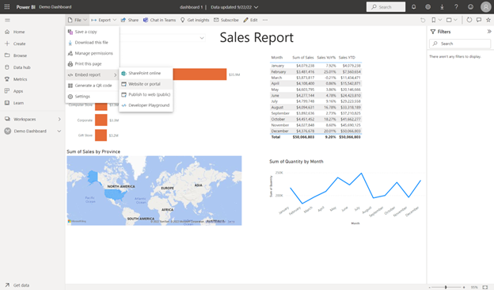
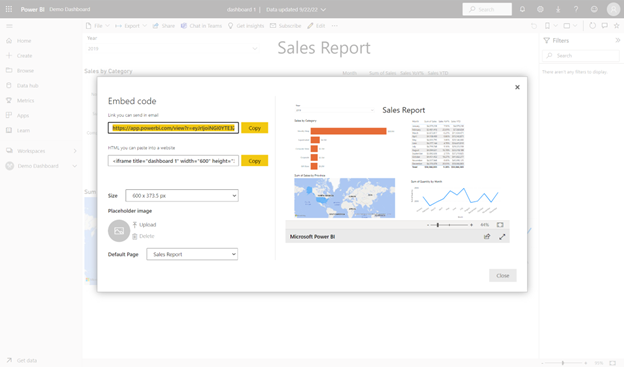
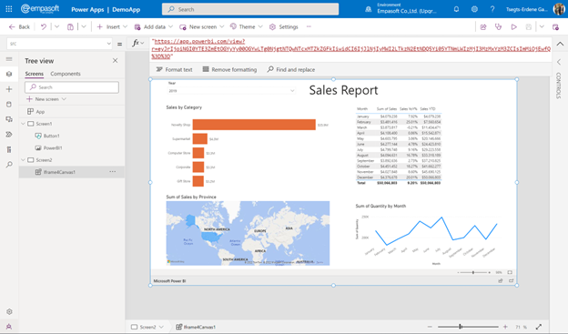

# About PowerBI Licensing

**PowerBI** can create a web link to the built-in dashboard and share it with **public** settings. Using this link, other users can see the dashboard in their **PowerApps**.

**Ажиллагааны дараалал:**

1.  Create and share your **PowerBI** dashboard.

    
    

2.  Copy the generated [link](https://app.powerbi.com/view?r=eyJrIjoiNGI0YTE3ZmEtOGYyYy00OGYwLTg0NjgtNTQwNTcxMTZkZGFkIiwidCI6IjJlNjIyMWI2LTkzN2EtNDQ5Yi05YTNmLWIzMjI3MzMxYzM3ZCIsImMiOjEwfQ%3D%3D).

    
    

3.  In **PowerApp**, copy the link to the **component** that displays the website.

    
    
